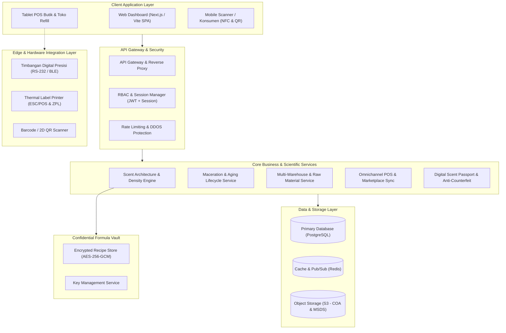
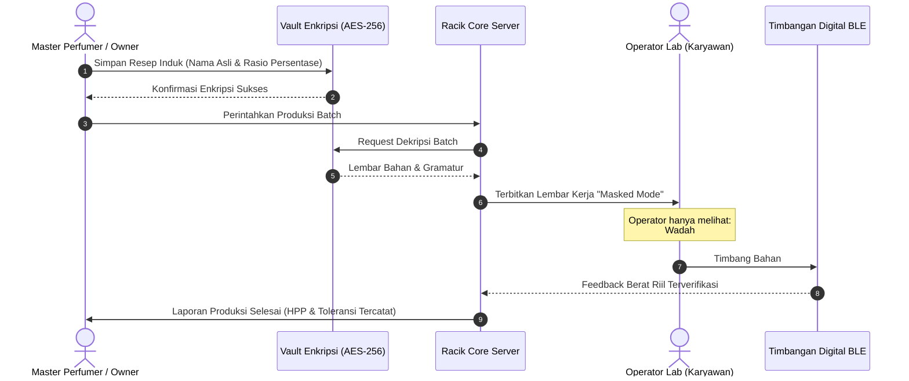

# Arsitektur Sistem Racik.

> **Spesifikasi Teknis, Desain Komponen, & Alur Data Platform Manajemen Wewangian**

Dokumen ini menjelaskan rancangan arsitektur perangkat lunak **Racik.**, mencakup topologi sistem, mesin kalkulasi kimia parfum (*scientific engine*), model keamanan data formula, dan integrasi perangkat keras operasional.

---

## 1. Diagram Arsitektur Tingkat Tinggi (High-Level Topology)

Sistem Racik dirancang dengan pola *modular client-server* yang memisahkan antarmuka pengguna, layanan logika bisnis, mesin perhitungan wewangian, dan kubah keamanan (*vault*):



---

## 2. Lapisan Sistem (System Layers)

### 2.1. Client Presentation Layer
* **Web Admin Portal**: Antarmuka desktop untuk pemilik bisnis, formulator kepala, dan manajer gudang. Menggunakan React 19, TypeScript, dan Tailwind CSS untuk performa tinggi dan rendering komponen cepat.
* **Tablet Point of Sale (POS)**: Antarmuka kasir layar sentuh yang dioptimalkan untuk butik wewangian, mendukung transaksi luring (*offline-first*) dan pencatatan varian ukuran (30ml, 50ml, 100ml, decant).
* **Mobile Batch Verifier**: Antarmuka web responsif ringan tanpa perlu unduh aplikasi untuk pemindaian QR Code dan verifikasi NFC oleh konsumen.

### 2.2. API Gateway & Keamanan Transmisi
* Seluruh komunikasi menggunakan **TLS 1.3**.
* Autentikasi berbasis **JWT (JSON Web Tokens)** dengan masa kedaluwarsa singkat dan *refresh token rotatif*.
* **Rate Limiter** di level gateway untuk memitigasi serangan brute-force pada endpoint verifikasi batch dan login.

### 2.3. Core Micro-Modules / Business Logic
1. **Specific Gravity & Unit Conversion Engine**: Modul yang bertanggung jawab mengonversi gramatur timbangan fisik menjadi mililiter botol jadi berdasarkan massa jenis bahan aktif.
2. **Maceration Lifecycle Tracker**: Modul yang memantau waktu tinggal cairan aromatik dalam tangki penuaan (*curing vat*).
3. **Omnichannel Inventory Synchronizer**: Menjembatani pengurangan stok fisik saat terjadi transaksi di kasir butik maupun pesanan marketplace (Shopee/Tokopedia).
4. **Authenticity Cryptographic Service**: Menghasilkan hash batch unik dan tautan verifikasi publik anti-duplikasi.

---

## 3. Mesin Kalkulasi Kimia & Formula (Scientific Engine)

### 3.1. Konversi Berat Jenis (Specific Gravity Calculation)
Dalam industri wewangian, **1 ml $\neq$ 1 gram**. Minyak atsiri murni memiliki kerapatan berbeda tergantung struktur hidrokarbon/terpenoidnya:

$$\text{Volume (ml)} = \frac{\text{Berat (gram)}}{\text{Berat Jenis (g/ml)}}$$

$$\text{Berat Total Batch (g)} = \sum_{i=1}^{n} (\text{Volume}_i \times \text{BJ}_i)$$

*Contoh parameter dalam sistem:*
- *Minyak Bergamot Calabria (Cold-Pressed)*: BJ = $0.875\text{ g/ml}$
- *Minyak Gaharu (Oud Assam)*: BJ = $0.982\text{ g/ml}$
- *Hedione (High cis)*: BJ = $1.012\text{ g/ml}$
- *Etanol 96% Denaturasi*: BJ = $0.805\text{ g/ml}$

Sistem Racik secara otomatis menghitung berat gram riil yang harus ditimbang operator lab saat meracik batch volume besar (misalnya 10 liter), mencegah kesalahan takaran yang membuat aroma batch tidak konsisten.

### 3.2. Algoritma Toleransi Evaporasi (Angels' Share)
Selama proses maserasi 14–45 hari dalam tangki stainless, terjadi penguapan fraksi volatil alkohol:

$$\text{Volume Akhir} = \text{Volume Awal} \times (1 - \kappa \cdot t)$$

Di mana:
- $\kappa$ = koefisien susut rata-rata ($0.0008\text{ per hari}$ pada suhu lab $16\text{--}18^\circ\text{C}$)
- $t$ = durasi maserasi (hari)

Sistem Racik mencatat penyusutan ini sebagai **penyesuaian maserasi alami**, bukan kebocoran stok atau tuduhan selisih kasir.

---

## 4. Arsitektur Keamanan Formula (Formula Vault & Masked Production)

Salah satu nilai jual paling vital dari Racik adalah melindungi **kekayaan intelektual (resep formula wewangian)** agar tidak dicuri atau dibocorkan oleh karyawan produksi.



1. **At-Rest Encryption**: Seluruh data persentase dan komposisi aroma dienkripsi menggunakan algoritma **AES-256-GCM** dengan kunci enkripsi per-tenant (*multi-tenant isolation*).
2. **Masked Production View**: Saat operator lab membuka antarmuka penimbangan, sistem menyamarkan nama dagang bibit (*supplier brand names*) dan hanya menampilkan nomor barcode lot tangki (*Container ID*).

---

## 5. Integrasi Perangkat Keras (Hardware & Edge Layer)

Racik dirancang untuk terhubung langsung dengan perangkat keras kasir dan laboratorium:

| Perangkat | Protokol Komunikasi | Fungsi dalam Racik |
|---|---|---|
| **Timbangan Lab Analitik** | Web Serial API / Bluetooth LE | Membaca berat gram penimbangan secara langsung ke layar tanpa perlu input manual, mendeteksi toleransi $\pm 0.05\text{ gram}$. |
| **Thermal Label Printer** | ESC/POS (USB/LAN) & ZPL | Mencetak label botol dengan barcode SKU, tanggal racik, nomor lot, dan QR verifikasi instan. |
| **Barcode / 2D Scanner** | USB HID Keyboard Emulation | Scan barang masuk dari drum supplier, botol kaca, serta kasir penjualan cepat. |
| **Sensor Suhu Tangki (Opsional)** | MQTT / HTTP Webhook | Memantau suhu ruang maserasi ($16\text{--}18^\circ\text{C}$) dan kelembaban udara gudang. |

---

## 6. Model Data Relasional Inti (Entity Relationship Summary)

```text
[RawMaterials] 1 --- * [BatchIngredients] * --- 1 [BatchOrders]
     |                                                    |
     *                                                    *
[Suppliers]                                       [FinishedBottles]
                                                          |
                                                          *
                                                [DigitalScentPassport]
```

- **RawMaterials**: Menyimpan nama bahan (bibit aroma, alkohol, flacon botol, sprayer, kemasan), berat jenis (specific gravity), harga per satuan beli (per kg / drum), dan stok tersisa.
- **Formulas**: Menyimpan struktur piramida aroma (Top, Heart, Base), target konsentrasi, dan catatan uji organoleptik.
- **BatchOrders**: Menyimpan proses peracikan volume tertentu, tanggal mulai maserasi, tanggal siap panen, dan status filtrasi.
- **FinishedBottles**: Menyimpan nomor seri unik botol jadi yang siap didistribusikan ke outlet atau toko online.
- **DigitalScentPassport**: Menyimpan metadata publik yang dapat diakses konsumen saat memindai QR botol.

---

## 7. Skalabilitas & Rencana Penerapan (Deployment)

1. **Containerization**: Seluruh sistem dibungkus menggunakan Docker untuk kemudahan deployment ke server cloud lokal Indonesia (AWS Jakarta, GCP Jakarta, atau Biznet Gio) demi latensi rendah (<30ms).
2. **Offline Resilience**: Aplikasi POS butik mengimplementasikan *IndexedDB local cache*. Jika koneksi internet butik terputus, kasir tetap bisa melayani transaksi dan otomatis menyinkronkan data ke server pusat saat koneksi kembali online.
